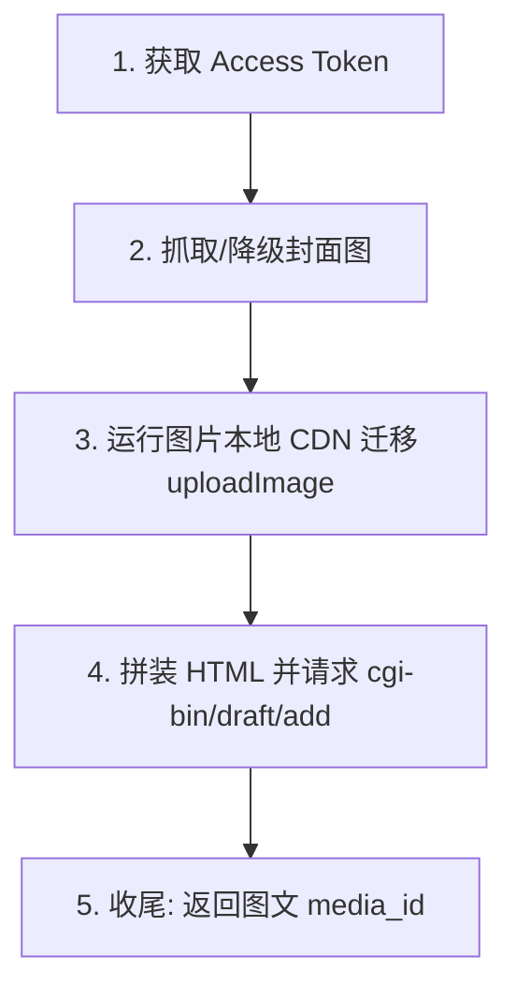

# 微信草稿箱发布技术细节文档 (WeChat Draft Box Technical Details)

本文档详细阐述项目在 `src/services/wechat.ts` 中与微信公众号接口（WeChat MP API）进行交互以实现**封面上传、正文插图 CDN 转换、及草稿创建**的核心技术链路、接口路由以及异常兜底逻辑。

---

## 🛰️ 整体执行链路

完成一次微信图文草稿的推送，共经历以下 4 个阶段：



---

## 🔑 1. 认证管理：`getAccessToken()`

系统每次触发新闻抓取时向微信请求一次 Access Token。由于运行在 **Cloudflare Workers (Edge)** 节点，出口 IP 会发生动态漂移。

- **API 接口**: `GET https://api.weixin.qq.com/cgi-bin/token`
- **必填参数**: 
  - `grant_type=client_credential`
  - `appid=${env.APPID}`
  - `secret=${env.APPSECRET}`

### 💡 IP 白名单诊断兜底 (Blocked IP Extraction)
由于微信公众平台要求配置出口 IP 白名单，在遇到微信拒绝时，系统内置了对错误响应字符串的智能拦截：
```typescript
const ipMatch = errmsg.match(/invalid ip ([^\s,]+)/i);
// 若匹配到，向上抛出带有极强引导性的自定义错误 [IP_WHITELIST_BLOCKED]
```
引导管理员快速去公众号后台将 drift 出来的边缘节点 IP 录入。

---

## 🖼️ 2. 素材管理：支持图片 CDN 转换及封面降级

由于微信文章限制外部图片（会有防盗链或不显示问题），所有信息源自带的图片需一律**先本地下载 Buffer，再流式上传**至微信素材库。

### A. 封面图直传：`uploadThumb()`
- **目标**: 获取用于新建草稿配图的 `thumb_media_id`。
- **API 接口**: `POST https://api.weixin.qq.com/cgi-bin/material/add_material?type=image` (通过 `FormData` 以 `media` 字段发送 Blob)
- **降级兜底逻辑**:
  - 系统首先尝试下载源新闻中的图片。
  - 若下载失败（HTTP 状态码异常），会在日志发出 Warn。
  - **自动回滚降级**至 `constants.ts` 中定义的 `API_URLS.DEFAULT_THUMB_IMAGE` 默认悉尼歌剧院或澳洲景观等高精大图，确保不会因图片缺失打断整个推送大链。

### B. 正文插图 CDN 渲染：`uploadImage()`
- **目标**: 获取以 `mmbiz.qpic.cn` 结尾的微信生态自有安全 CDN 图片链接，供 `` 标签直接展示。
- **API 接口**: 与 `uploadThumb` 相同，均调用 `add_material`。
- **返回映射**: 抓取组件成功后返回微信服务器返回的 `.url` 属性。
- **降级兜底逻辑**: 由于正文插图不是完全刚需（封面才是），该方法如果彻底超时或出错会**返回 null**，以便 caller 端安全滤除该图片标签，继续输出纯文本文章。

---

## 📝 3. 创建草稿：`createDraft()`

当 Access Token、`thumb_media_id` 和正文 HTML（由模块层拼接模版）全部就绪后，对草稿箱发起添加操作。

- **API 接口**: `POST https://api.weixin.qq.com/cgi-bin/draft/add`
- **Payload 请求体结构**:

```json
{
  "articles": [
    {
      "title": "...",           // 标题
      "author": "...",          // 作者
      "content": "...",         // HTML 格式全文
      "thumb_media_id": "...",  // 来自 uploadThumb 阶段
      "show_cover_pic": 1,      // 是否显示封面
      "digest": "..."           // 摘要
    }
  ]
}
```

### 💡 边界限制逻辑
- **摘要长度硬性截断**: 微信对摘要的限制极为严格。系统在提交时内置了：
  ```typescript
  digest ? { digest: digest.substring(0, 120) } : {}
  ```
  自动切割为前 120 个字，以消除由于 AI 生成废话多或者拼接新闻过长导致的 `errcode: 40008` (不合规摘要字符总数) 的阻断报错。

---

## 📦 对应数据响应结构 (`types/index.ts`)

```typescript
export interface WeChatDraftResponse {
  errcode?: number;
  errmsg?: string;
  media_id?: string;   // 创建成功后返回创建该组多图文的 media_id
}
```
```
收到该 `media_id` 即标志着新闻源信息流已平滑送入微信公众平台后台待审阅草稿栏，手动触发时系统会直接将该 ID 打印在视图。

---

## 🎨 4. 排版样式与 HTML 模版细节 (`src/templates/article.ts`)

微信公众号内置的 HTML 解析引擎极为特殊，**不支持外部 `<link>` 样式表和 `<style>` 内嵌框**。若需在手机端完美显化排版，必须在模版层对每个标签精确使用 **Inline CSS (内联样式)**。

### 🎨 配色记号（Color Tokens）
系统预设了一套媲美 **mdnice** 的清新极简无干扰阅读风格：
- **正文字体**: `#3a3a3a`
- **弱化文本**: `#888888`
- **悬停/强调（Accent）**: `#2980b9`（冷静深空蓝）
- **背板卡片**: `#f5f7fa`

---

### 📷 A. 图片排版防崩溃锁定
1. **全局最大尺寸**: `.div` 路由中预埋 `max-width:680px; margin:0 auto;` 锁定宽度屏栅，防止平板或 PC 端加载时文字溢出。
2. **长比例插图适配**:
   - 首页大一图 Hero Card 默认完整渲染：`width:100%; display:block;`
   - 后续次级新闻卡片则采用 **3:1 的宽频裁剪高阶排布**：
     ```html
     
     ```
     保持公众号整页视觉的高度节奏统一。

---

### 📝 B. 卡片与板块模版结构

#### 1. 新闻区块分级
- **首发大图主卡 (Hero Card)**: 
  - 具有首发主视觉大图覆盖、加大字号标题 (`20px`)。
  - **亮点提示块**: 在翻译部分使用 `background: #f5f7fa; border-left: 4px solid #2980b9;` 构建出类似“引用块”或“导言”格式，方便微信读者一眼捕捉 AI 抽阅要素。
- **次级普通卡片 (Secondary Card)**: 
  - 通过 `border-top: 1px solid #e5e5e5` 实线分隔，结构稍作下沉，保持排版主次分明。

#### 2. 学词卡组 (Vocab Section)
AI 提词的 `word | pos | definition | example` 行采用流式拆分后：
- 单独包装成上下留有 `margin: 20px` 呼吸档位的悬垂项。
- 例句例词处内置正则渲染，动态将 `example` 字符串中匹配 `word` 的地方包裹为 `<strong style="color: #2980b9;">`。在微信内置端让词根词缀一目了然。

*(注：系统默认向每个核心字段追加 `word-break:break-word; text-align:left;` 以预防英文字符长串将微信框架撑宽的常见排版 Bug)。*

